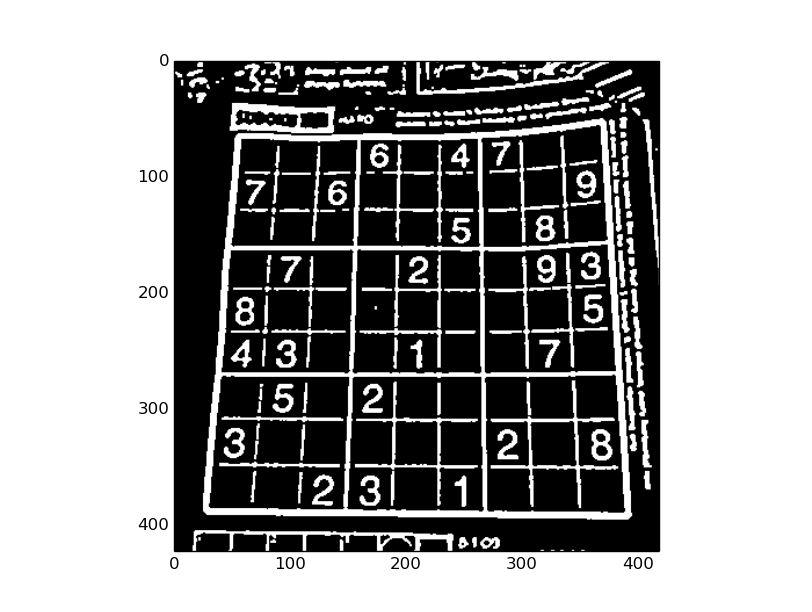
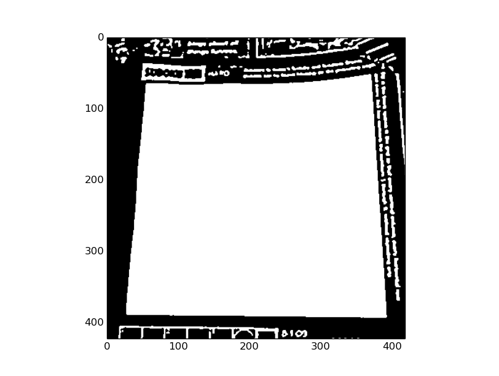
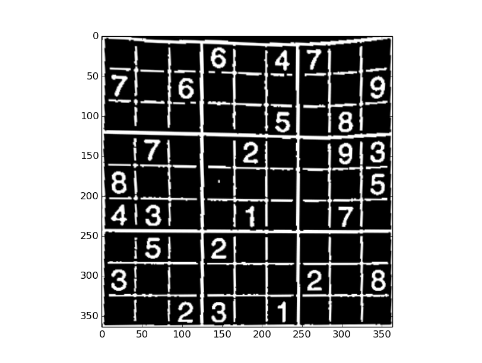
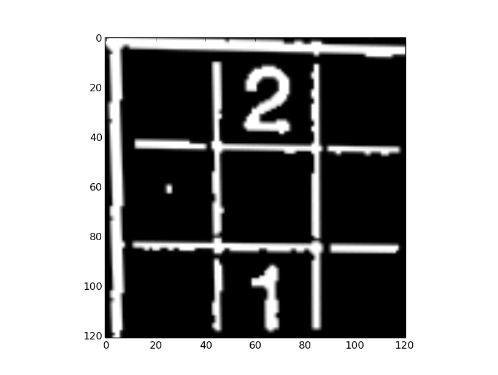
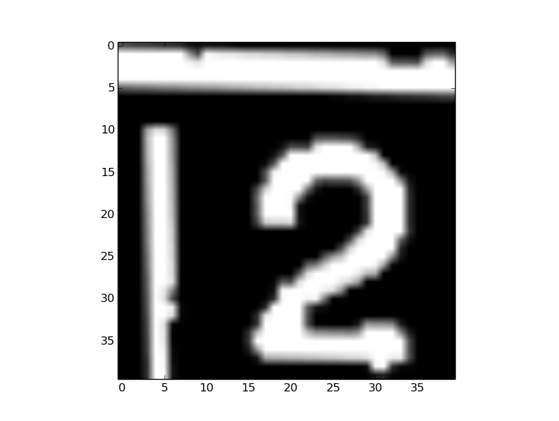
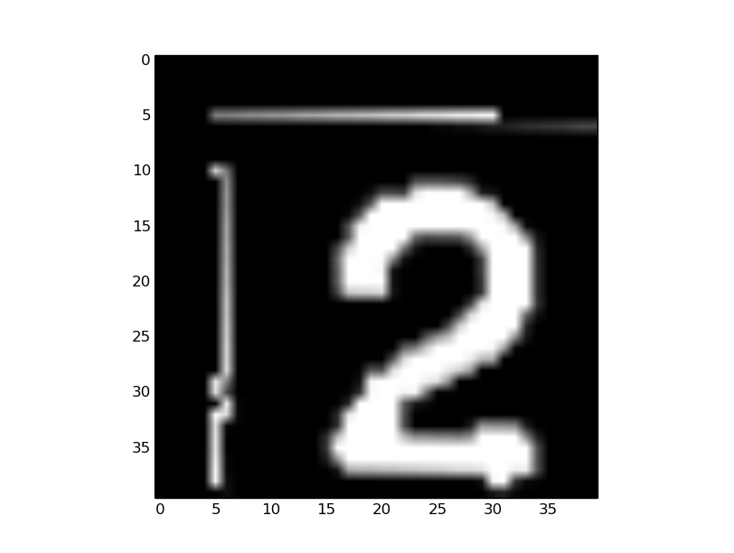
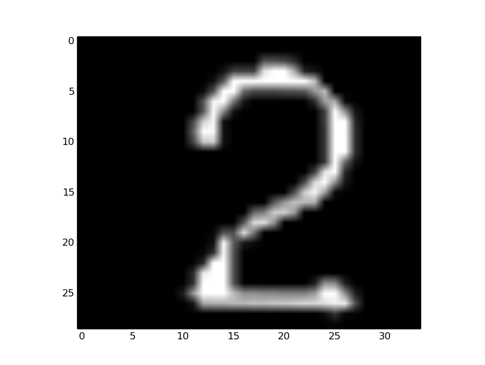
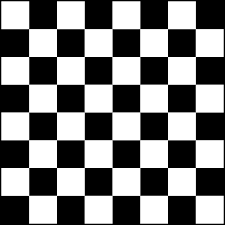
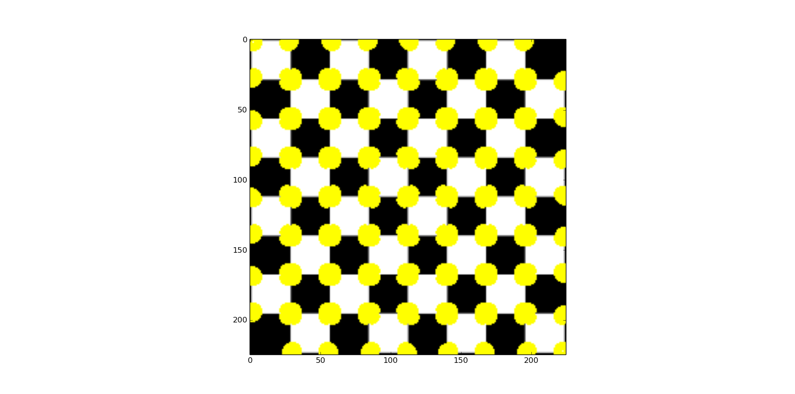
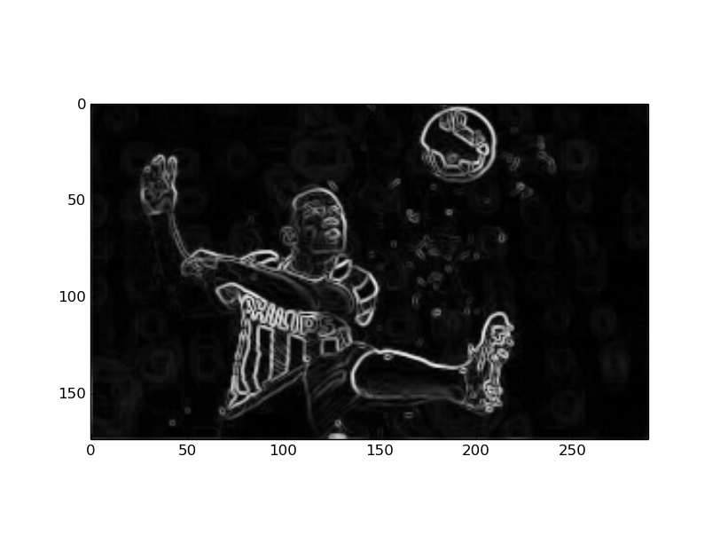

# computerVision
### Currently available scripts.
* Sudoku Solver
* Harris Corner Detector
* Irregular Shape Detection
* Hough Transform
* Prototype License Plate Detection
* Contour
* PCA
* Convolution, can be extended to edge detection. (Sobel Filter). Speed of convolution to be improved.
* Edge Filter implemented by convolving image with the mask. To be extended for color edges.

###EXAMPLE 
* Sudoku Solver

 
 * Adaptive Thresholding 
 
 * Detect Contour with biggest area
 
 * Perspective Transform
 
 
 
 * FloodFill in the boundaries
 
 * Eroded and Scaled
 

* Harris Corner Detector
  
 
 

* Edge Detection

 
 
 

### Resources
* [SudoKu Solver](http://aishack.in/tutorials/sudoku-grabber-opencv-plot/)
* [Edge Detection](http://blog.saush.com/2011/04/20/edge-detection-with-the-sobel-operator-in-ruby/) 
* [Computer Vision Cook Book](http://programmingcomputervision.com/)

