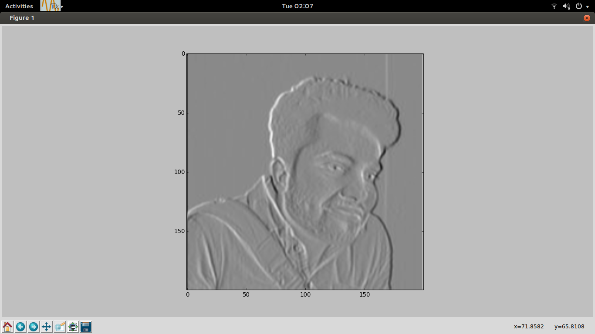
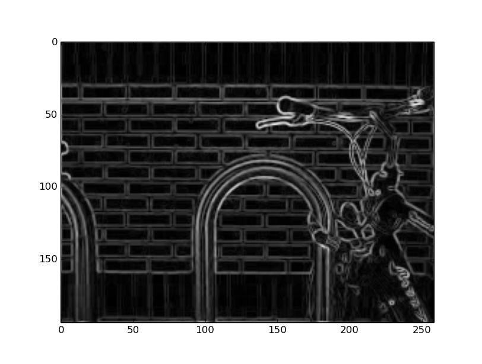
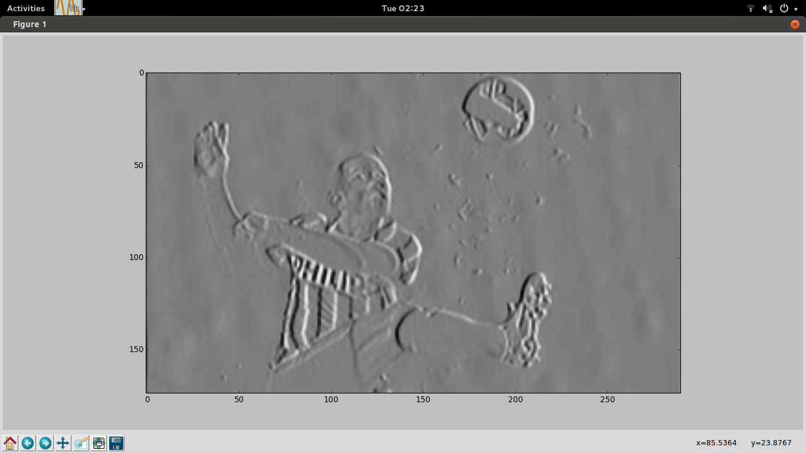

# computerVision
### Currently available scripts.
* Contour
* PCA
* Convolution, can be extended to edge detection. (Sobel Filter). Speed of convolution to be improved.
* Edge Filter implemented by convolving image with the mask. To be extended for color edges.
* To do : Parallelizing and optimizations
###EXAMPLE 
 

 

 

 

 

 

### Resources
* [Edge Detection](http://blog.saush.com/2011/04/20/edge-detection-with-the-sobel-operator-in-ruby/) 
* [Computer Vision Cook Book](http://programmingcomputervision.com/)
